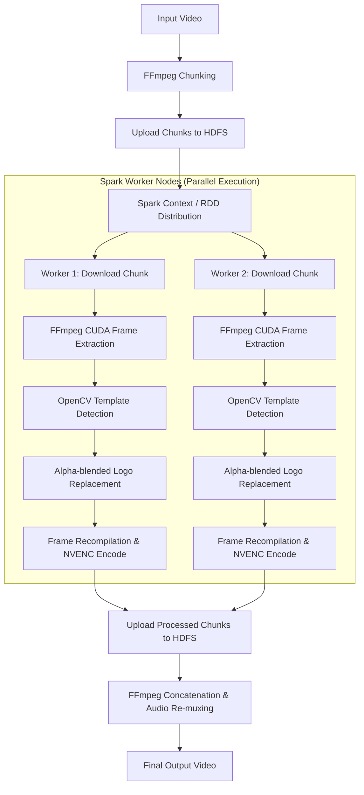

# Real-Time High-Quality Video Editing System (Big Data)

A high-performance, distributed, and GPU-accelerated video editing pipeline designed for logo detection and replacement in high-definition video streams. This system leverages **Apache Spark** and **HDFS** for horizontal scalability, **OpenCV** for computer vision-based template matching, and **FFmpeg with CUDA / NVENC** for hardware-accelerated video decoding, frame extraction, and encoding.

---

## 🚀 Key Features

* **High-Throughput Parallel Processing:** Integrates **Apache Spark** to distribute video segments across cluster nodes, enabling concurrent frame-level processing.
* **GPU-Accelerated Video Pipeline:** Uses **FFmpeg with CUDA/NVIDIA NVENC** support for hardware-accelerated video decoding and encoding, eliminating CPU bottlenecking.
* **Multi-Scale Logo Detection:** Employs multi-scale template matching using OpenCV (`cv2.matchTemplate` with Normalized Cross-Correlation) to locate logo templates at varying scales (0.8x to 2.0x) with high precision (confidence > 0.97).
* **Seamless Alpha Blending:** Integrates new logos using custom alpha-mask blending with frame boundary checks and dynamic resizing.
* **Distributed Storage Integration:** Designed to read from and write to **Hadoop Distributed File System (HDFS)** for managing large video datasets.
* **Comprehensive Performance Metrics:** Built-in resource profiling (using `psutil`) for tracking CPU, memory, and GPU processing times per frame.

---

## 🛠️ Technology Stack

* **Big Data Framework:** Apache Spark (PySpark), Hadoop & HDFS
* **Computer Vision:** OpenCV (Python-OpenCV), NumPy
* **Video Encoding/Decoding:** FFmpeg, FFprobe (with CUDA & h264_nvenc)
* **GPU Acceleration:** NVIDIA CUDA, TensorFlow, PyTorch
* **Programming Languages:** Python, Jupyter Notebooks

---

## 📐 System Architecture

The pipeline divides large video datasets into manageable chunks, distributes processing tasks across a Spark cluster, processes individual frames in parallel using GPU acceleration, and stitches the frames back into high-quality video files.



---

## 📂 Repository Structure

* `spark/`: Scripts containing the PySpark implementation for cluster deployment.
  * `complete_with_hdfs.py`: Implements video splitting, HDFS file transfers, and RDD-driven parallel frame extraction.
  * `complete_no_hdfs_gpu.py`: Leverages Spark parallelization combined with GPU acceleration for frame decoding.
* `fill-sequential/`: Local end-to-end processing pipelines (v1 to v5).
  * `full-v5.py`: The most advanced local version, using Python multiprocessing and ThreadPools combined with FFmpeg + CUDA filters for parallel local execution.
* `logo-replacer/`: Core computer vision algorithms.
  * `logo-replacer-v0`: Python class implementation for multi-scale template matching and alpha blending.
* `frame-extractor/`: Helper scripts for sequential frame extraction experiments.
* `chunker-sequential/`: Script and analysis files evaluating video segment chunk durations.
* `gpu-tester/`: GPU test suites to benchmark PyTorch, TensorFlow, and hardware decoding speeds.
* `docs/`: Design documentation, HLD (High-Level Design), system requirements specification, acceptance emails, and review presentation slides.

---

## 📈 Performance & Benchmarking

Benchmarks gathered from runtime logs (`full-v5` and `logo-replacer`) demonstrate significant performance improvements under different configurations:

| Metric | Sequential CPU Pipeline | GPU-Accelerated Threaded Pipeline | Spark Cluster (10 Executors) |
| :--- | :---: | :---: | :---: |
| **Logo Detection Time (per frame)** | ~3,245 ms | ~800 ms (CUDA) | Parallelized across cluster |
| **Frame Processing Speed** | ~0.3 FPS | ~1.2 FPS (Multithreaded) | Scale-out capability |
| **Resolution Support** | Full HD (1080p) | Full HD (1080p) | Full HD / 4K UHD |
| **Video Compilation** | Standard CPU (H.264) | Hardware NVENC (h264_nvenc) | Node-level local NVENC |

---

## ⚙️ Setup and Installation

### 1. Prerequisites
Ensure the following are installed and configured on your system:
- **Python 3.8+**
- **FFmpeg** compiled with `--enable-cuda` and `--enable-nvenc` options
- **NVIDIA Driver** & **CUDA Toolkit** (for GPU-accelerated versions)
- **Apache Spark 3.x** and **Hadoop 3.x** (for cluster deployment)

### 2. Python Packages
Install the required Python dependencies:
```bash
pip install opencv-python numpy PySpark psutil tqdm
```

---

## 📖 How to Run

### Sequential Pipeline (Local execution with GPU overlay acceleration)
1. Configure your video and logo paths in `fill-sequential/full-v5.py`:
   ```python
   processor = GPUVideoLogoReplacer(
       input_video="path/to/video.mp4",
       old_logo="path/to/old-logo.png",
       new_logo="path/to/new-logo.png",
       output_dir="output"
   )
   processor.process_video()
   ```
2. Execute the script:
   ```bash
   python fill-sequential/full-v5.py
   ```

### Distributed Spark Pipeline (Cluster deployment)
1. Set up your environment variables for Spark/Hadoop.
2. Submit the Spark job:
   ```bash
   spark-submit --master spark://your-master:7077 spark/complete_with_hdfs.py
   ```

---

## 📝 License
This project is licensed under the Apache 2.0 License - see the [LICENSE](LICENSE) file for details.
